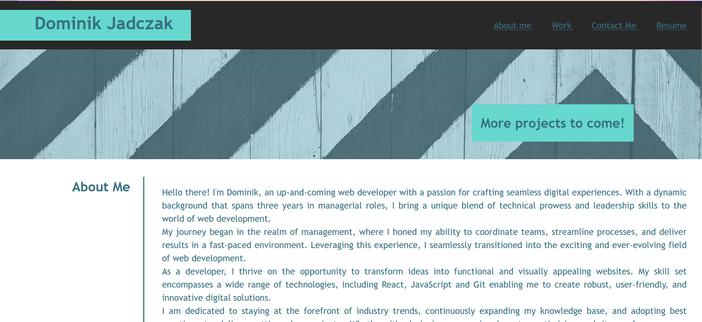
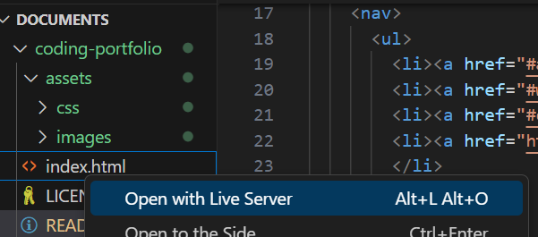

# Coding Portfolio


<details>
  <summary>Table of Contents</summary>
  <ol>
    <li><a href="#Description">Description</a></li>
    <li><a href="#Screenshot">Screenshot</a></li>
    <li><a href="#Installation ">Installation</a></li>
    <li><a href="#Usage">Usage</a></li>
    <li><a href="#Link">Link</a></li>
    <li><a href="#Credits">Credits</a></li>
    <li><a href="#License">License</a></li>
  </ol>
</details>


## Description

The purpose of this portfolio website is to showcase my professional work, skills and achievements. The main goal of a portfolio website is to demonstrate technical skills and expertise by showcasing various different projects. A portfolio website will allow me to stand out from other candidates when applying for jobs as potential employers will be able to see my experience, background and capabilities. A well organised and visually appealing portfolio will enhance my personal brand as it will showcase my individual style and personality. As I complete more projects I will be adding my favourite ones to this portfolio. I hope that this webpage will open up many opportunities for career and professional growth.


## Screenshot





## Installation


To install this project clone the repo
    ```
    git clone git@github.com:Dominik-Jad/coding-portfolio.git
    ```
    <br>
Open the files in VS Code and select 'Open With Live Server' on index.html





Any changes you make to the HTML and CSS will be automatically updated on the live server.


## Usage


This project will be used as a central hub to showcase my skills, experience, and the diverse range of projects I've worked on as a web developer over the years. Whether you're a potential employer, collaborator, or just curious about my work, this portfolio offers a comprehensive view of my journey in the world of web development.


## Link


https://dominik-jad.github.io/coding-portfolio/


## Credits
Flex box - https://css-tricks.com/snippets/css/a-guide-to-flexbox/
<br>

SGrid Layout - https://css-tricks.com/snippets/css/complete-guide-grid/

Media queries - https://developer.mozilla.org/en-US/docs/Web/CSS/CSS_media_queries/Using_media_queries


## License


Please refer to the LICENSE in the repo.